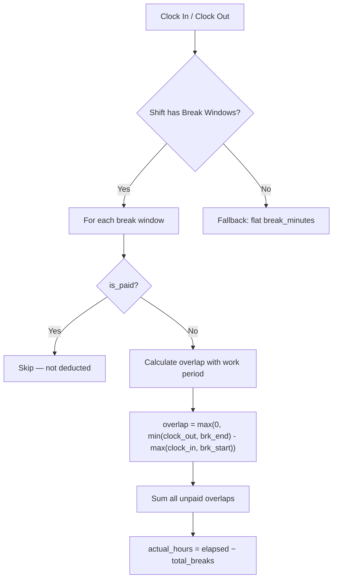

# Named Break Windows — Walkthrough

Replaced the flat `break_minutes` deduction with a precise, overlap-based break calculation system that handles multiple named breaks, overnight shifts, partial overlaps, and paid breaks.

---

## Data Model

New [ShiftBreak](file:///Users/cholan/MyProjects/ReactJS/mathi/ezyHR-PRP/backend/app/models/attendance.py#28-39) model in [attendance.py](file:///Users/cholan/MyProjects/ReactJS/mathi/ezyHR-PRP/backend/app/models/attendance.py):

| Field | Type | Purpose |
|---|---|---|
| `label` | String | Break name (e.g., "Lunch", "Dinner") |
| `break_start` | Time | Window start (e.g., 12:00) |
| `break_end` | Time | Window end (e.g., 13:00) |
| `is_paid` | Boolean | If `true`, break is **NOT** deducted from work hours |
| `sort_order` | Integer | Display ordering in UI |

Migration `cfdbccce6af0` created the [shift_breaks](file:///Users/cholan/MyProjects/ReactJS/mathi/ezyHR-PRP/backend/app/services/attendance.py#95-99) table with cascade delete on `shift_id`.

---

## Overlap Deduction Logic

### Key Logic in [compute_daily_attendance](file:///Users/cholan/MyProjects/ReactJS/mathi/ezyHR-PRP/backend/app/services/attendance.py#L218-L255)

- **Overnight handling** — Breaks with `start < shift.start_time` shifted to next calendar day
- **Midnight-crossing** — Breaks where `end < start` get +1 day on end time
- **Partial overlaps** — Only the actual overlap is deducted (e.g., leave at 12:30 = 30min, not 60min)
- **Backward compatible** — No break windows defined → falls back to `shift.break_minutes`

---

## Verification — All 6 Scenarios Passed ✅

| # | Scenario | Clock In → Out | Breaks Deducted | Result |
|---|---|---|---|---|
| 1 | Normal Day | 9:00 → 18:00 | Lunch 60m | **8.0h** ✅ |
| 2 | Extended to Midnight | 9:00 → 00:00 | Lunch + Dinner 120m | **13.0h** ✅ |
| 3 | Full 24h | 9:00 → next 9:00 | Lunch + Dinner + Breakfast 180m | **21.0h** ✅ |
| 4 | Partial mid-lunch | 9:00 → 12:30 | 30m partial overlap | **3.0h** ✅ |
| 5 | Paid Tea Break | 9:00 → 18:00 | Lunch unpaid + Tea paid (NOT deducted) | **8.0h** ✅ |
| 6 | Backward Compat | 9:00 → 18:00 | No windows, flat 60m | **8.0h** ✅ |

---

## Frontend — Shift Modal Break Rows

Updated [ShiftSettings.tsx](file:///Users/cholan/MyProjects/ReactJS/mathi/ezyHR-PRP/frontend/src/pages/settings/ShiftSettings.tsx):

- **Repeatable rows** — Add/Remove breaks with Label, Start/End time pickers, Paid checkbox
- **Card display** — Break count, total unpaid minutes, per-break details on shift cards
- **Scrollable modal** — Widened to `max-w-2xl` with `overflow-y-auto`
- **Bulk save** — All breaks saved via `PUT /shifts/{id}/breaks`

---

## API Endpoints

| Method | Path | Purpose |
|---|---|---|
| `PUT` | `/shifts/{id}/breaks` | Replace all breaks for a shift |
| `GET` | `/shifts/{id}/breaks` | List breaks for a shift |
| `DELETE` | `/shifts/{id}/breaks/{bid}` | Delete individual break |

---

## Files Changed

| File | Change |
|---|---|
| [models/attendance.py](file:///Users/cholan/MyProjects/ReactJS/mathi/ezyHR-PRP/backend/app/models/attendance.py) | [ShiftBreak](file:///Users/cholan/MyProjects/ReactJS/mathi/ezyHR-PRP/backend/app/models/attendance.py#28-39) model + `Shift.breaks` relationship |
| [schemas/attendance.py](file:///Users/cholan/MyProjects/ReactJS/mathi/ezyHR-PRP/backend/app/schemas/attendance.py) | [ShiftBreakCreate](file:///Users/cholan/MyProjects/ReactJS/mathi/ezyHR-PRP/backend/app/schemas/attendance.py#28-30), [ShiftBreakRead](file:///Users/cholan/MyProjects/ReactJS/mathi/ezyHR-PRP/backend/app/schemas/attendance.py#31-37), [breaks](file:///Users/cholan/MyProjects/ReactJS/mathi/ezyHR-PRP/backend/app/api/v1/attendance.py#193-201) on [ShiftRead](file:///Users/cholan/MyProjects/ReactJS/mathi/ezyHR-PRP/backend/app/schemas/attendance.py#41-48) |
| [services/attendance.py](file:///Users/cholan/MyProjects/ReactJS/mathi/ezyHR-PRP/backend/app/services/attendance.py) | Break CRUD + overlap logic in [compute_daily_attendance](file:///Users/cholan/MyProjects/ReactJS/mathi/ezyHR-PRP/backend/app/services/attendance.py#143-270) |
| [api/v1/attendance.py](file:///Users/cholan/MyProjects/ReactJS/mathi/ezyHR-PRP/backend/app/api/v1/attendance.py) | 3 break endpoints |
| [ShiftSettings.tsx](file:///Users/cholan/MyProjects/ReactJS/mathi/ezyHR-PRP/frontend/src/pages/settings/ShiftSettings.tsx) | Break rows UI + card display |
| Migration `cfdbccce6af0` | [shift_breaks](file:///Users/cholan/MyProjects/ReactJS/mathi/ezyHR-PRP/backend/app/services/attendance.py#95-99) table |
