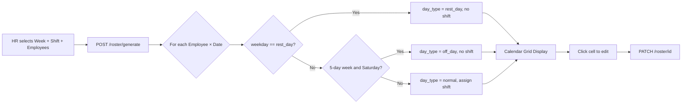

# Roster Management — Walkthrough

Built a complete shift roster management system with a calendar grid UI, smart auto-generation using employee-level rest day data, and inline cell editing.

---

## Architecture



---

## Smart Auto-Generation

Uses existing [Employment](file:///Users/cholan/MyProjects/ReactJS/mathi/ezyHR-PRP/backend/app/models/employment.py#81-115) fields to eliminate manual work:

| Employment Field | Auto-Generation Behavior |
|---|---|
| `rest_day` (e.g., "Sunday") | That weekday → **Rest Day**, no shift assigned |
| `working_days_per_week` (e.g., 5.0) | If ≤ 5, Saturday → **Off Day**, no shift assigned |
| Otherwise | **Normal** day with the selected shift |

HR clicks **"Auto-Generate"**, picks a shift and employees → system fills the entire week grid.

Logic in [auto_generate_roster](file:///Users/cholan/MyProjects/ReactJS/mathi/ezyHR-PRP/backend/app/services/attendance.py#L177-L244):

```python
WEEKDAY_MAP = {"monday": 0, ..., "sunday": 6}

for each employee:
    rest_day_num = WEEKDAY_MAP[employee.rest_day]
    for each date in range:
        if date.weekday() == rest_day_num:
            → rest_day (no shift)
        elif working_days <= 5 and Saturday:
            → off_day (no shift)
        else:
            → normal (assigned shift)
```

---

## Backend — Service Methods

In [services/attendance.py](file:///Users/cholan/MyProjects/ReactJS/mathi/ezyHR-PRP/backend/app/services/attendance.py):

| Method | Purpose |
|---|---|
| [auto_generate_roster()](file:///Users/cholan/MyProjects/ReactJS/mathi/ezyHR-PRP/backend/app/services/attendance.py#182-241) | Smart generation with rest_day/working_days logic |
| [get_roster_enriched()](file:///Users/cholan/MyProjects/ReactJS/mathi/ezyHR-PRP/backend/app/services/attendance.py#264-305) | JOINed query → employee name + shift name for display |
| [update_roster_cell()](file:///Users/cholan/MyProjects/ReactJS/mathi/ezyHR-PRP/backend/app/api/v1/attendance.py#266-279) | Cell PATCH — auto-clears shift for RD/OFF/PH |
| [delete_roster_cell()](file:///Users/cholan/MyProjects/ReactJS/mathi/ezyHR-PRP/backend/app/api/v1/attendance.py#280-292) | Remove single roster assignment |

---

## API Endpoints

All 5 confirmed registered via `curl` against OpenAPI spec:

| Method | Path | Purpose |
|---|---|---|
| `GET` | `/attendance/roster` | Enriched list with employee + shift names |
| `POST` | `/attendance/roster/generate` | Smart auto-generate |
| `POST` | `/attendance/roster/bulk` | Simple bulk assign (all same shift) |
| `PATCH` | `/attendance/roster/{id}` | Edit individual cell |
| `DELETE` | `/attendance/roster/{id}` | Remove individual cell |

---

## Frontend — Calendar Grid

[RosterManagement.tsx](file:///Users/cholan/MyProjects/ReactJS/mathi/ezyHR-PRP/frontend/src/pages/attendance/RosterManagement.tsx):

| Feature | Details |
|---|---|
| **Calendar Grid** | Employee × 7-day table, sticky employee column |
| **Week Navigation** | ◀ Prev / Next ▶ buttons, formatted week label |
| **Color Coding** | Blue = Shift, Red = RD, Gray = OFF, Orange = PH |
| **Click-to-Edit** | Dropdown picker with available shifts + day types |
| **Auto-Generate Modal** | Shift selector + employee list with checkboxes + Select All |
| **Legend Bar** | Color key for shift abbreviations and day types |

### UI Layout

```
┌──────────────────────────────────────────────────────────────┐
│ 📅 Shift Roster         [◀ Prev]  Mar 3-9, 2026  [Next ▶]  │
│                                          [Auto-Generate 🔄] │
├──────────────┬──────┬──────┬──────┬──────┬──────┬──────┬─────┤
│ Employee     │ Mon  │ Tue  │ Wed  │ Thu  │ Fri  │ Sat  │ Sun │
├──────────────┼──────┼──────┼──────┼──────┼──────┼──────┼─────┤
│ Ahmad        │  MOR │  MOR │  MOR │  MOR │  MOR │ OFF  │ RD  │
│ Siti         │  AFT │  AFT │  AFT │  AFT │  AFT │ OFF  │ RD  │
│ Rajan        │  NIG │  NIG │  NIG │  NIG │  NIG │  NIG │ RD  │
└──────────────┴──────┴──────┴──────┴──────┴──────┴──────┴─────┘
  Legend: MOR=Morning  AFT=Afternoon  NIG=Night  RD=Rest Day  OFF=Off Day
```

---

## Files Changed

| File | Change |
|---|---|
| [schemas/attendance.py](file:///Users/cholan/MyProjects/ReactJS/mathi/ezyHR-PRP/backend/app/schemas/attendance.py) | [RosterAutoGenerate](file:///Users/cholan/MyProjects/ReactJS/mathi/ezyHR-PRP/backend/app/schemas/attendance.py#88-94), [RosterCellUpdate](file:///Users/cholan/MyProjects/ReactJS/mathi/ezyHR-PRP/backend/app/schemas/attendance.py#95-98), [RosterReadEnriched](file:///Users/cholan/MyProjects/ReactJS/mathi/ezyHR-PRP/backend/app/schemas/attendance.py#99-111) |
| [services/attendance.py](file:///Users/cholan/MyProjects/ReactJS/mathi/ezyHR-PRP/backend/app/services/attendance.py) | 4 new service methods |
| [api/v1/attendance.py](file:///Users/cholan/MyProjects/ReactJS/mathi/ezyHR-PRP/backend/app/api/v1/attendance.py) | 4 new API endpoints |
| [RosterManagement.tsx](file:///Users/cholan/MyProjects/ReactJS/mathi/ezyHR-PRP/frontend/src/pages/attendance/RosterManagement.tsx) | **NEW** — Full calendar grid page |
| [App.tsx](file:///Users/cholan/MyProjects/ReactJS/mathi/ezyHR-PRP/frontend/src/App.tsx) | Route: `attendance/roster` |
| [Sidebar.tsx](file:///Users/cholan/MyProjects/ReactJS/mathi/ezyHR-PRP/frontend/src/components/Layout/Sidebar.tsx) | "Roster" nav link added |
